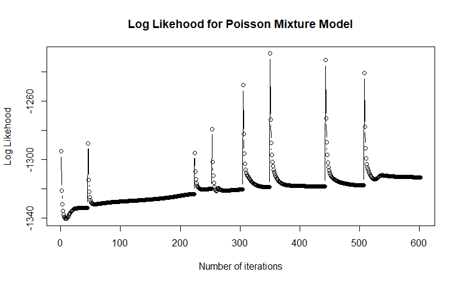

```{r, include = FALSE}
knitr::opts_chunk$set(
  collapse = TRUE,
  comment = "#>"
)
```

```{r setup}
library(Pmm)
```

## Title

Expectation-Maximization Algorithm for Multivariate Poisson Distribution

## Description

The Expectation-Maximization (EM) algorithm is an iterative procedure
for estimating parameters in statistical models when there are latent
variables involved. This package focuses on applying the EM algorithm to
fit a multivariate Poisson distribution to given data.

In order to determine for each observation the probability of belonging
to each cluster we maximize the likelihood function until convergence.
The algorithm is initialized with random values for the parameters of
the Poisson distribution. The algorithm is stopped when the difference
between the likelihood function at two consecutive iterations is less
than a given threshold.

While iterating, we calculate the *tk* matrix which contains the
probability of each observation to belong to each cluster. We also
calculate the *pk* vector which contains the proportions of each
cluster. The *Lambdas* matrix contains the parameters of the Poisson
distribution for each cluster.

Then, we calculate the log-likelihood function by the following formula:

$\sum_{k=1}\sum_{n=1}t_{k}(xi)log(f(x_n|\lambda_k))$

where $t_{k}(xi)$ is the probability of observation $x_i$ to belong to
cluster $k$ and $f(x_n|\lambda_k)$ is the Poisson probability density
function for observation $x_n$ and cluster $k$.

In order to determine the number of clusters, we use the Bayesian
Information Criterion (BIC). A criterion for model selection among a
finite set of models; the model with the higher BIC is preferred. It is
based, in part, on the likelihood function and it is closely related to
the Akaike Information Criterion (AIC). For a model with *p* parameters
and likelihood function *L*, the definition of the BIC is:

```{r}
bic <- 2 * log(L) - p * log(n)
```

The issue with our EM algorithm is that the BIC criterion decreases with
the number of clusters. As a result, the BIC criterion will always favor
the first model with *K* = the first given number of clusters. 

The source of the problem may be the log-likelihood function formula,
even if it converges correctly, as can be seen in the following graph.


In order to solve our issue, we tried to use an alternative formula :
$\prod_{i}\sum_{k}p_kf_k(x_i)$

where $p_k$ is the proportion of cluster $k$ and $f_k(x_i)$ is the
probability density function of observation $x_i$ for cluster $k$. The
issue with this formula of the log-likelihood function is that the value
of *tk* and *pk* are so low at the first iterations that the
log-likelihood function is equal to 0. As a result, the algorithm stops
at the first iteration.

Since the sum of each of the *tk* rows is equal to 1 (the sum of the
*tk* matrix is equal to *n*) and the sum of the *pk* vector is also
equal to 1. We don't think that the issue comes from the calculation of
the *tk* matrix or the *pk* vector.

## Usage

```{r}
n <- 200  # Number of rows
lambda1 <- 3  # Poisson parameter for column 1
lambda2 <- 5  # Poisson parameter for column 2
lambda3 <- 7  # Poisson parameter for column 3

# Generate random Poisson-distributed values
x1 <- rpois(n, lambda1)
x2 <- rpois(n, lambda2)
x3 <- rpois(n, lambda2)

# Create the data frame
X <- data.frame(x1, x2,x3)

# plot the data
plot(X)
```
